# Project: Suricata IDS/IPS Integration with Wazuh SIEM for Network Threat Detection

## Table of Contents
- [Overview](#overview)
- [Organizational Application](#organizational-application)
- [Configuration & Screenshots](#configuration--screenshots)
- [Observations and Challenges](#observations-and-challenges)
- [Reflections](#reflections)
- [How to Reproduce](#how-to-reproduce)

## Overview
This project extends the previous Wazuh SIEM implementation Project by integrating Suricata IDS/IPS (Intrusion Detection/Prevention System) for enhanced network security monitoring. The deployment includes Suricata on the Ubuntu VM (10.174.188.11) with Emerging Threats rulesets, enabling detection of network-based attacks including ping scans, SSH brute force attempts, and NMAP scans from an external Kali Linux machine.

---

## Organizational Application

### Importance to Companies
Suricata IDS/IPS provides organizations with real-time network threat detection capabilities, complementing Wazuh's host-based monitoring. This layered security approach enables comprehensive threat visibility across both network and endpoint levels.

### Use Case Scenario
A company needs to detect and prevent network-based attacks targeting their infrastructure. The Suricata-Wazuh integration provides:
- Real-time network intrusion detection
- Correlation of network events with host-based alerts
- Detection of reconnaissance activities (port scans, service discovery)
- Prevention of brute force attacks and exploitation attempts

### Security Benefits
- **Network Visibility**: Monitors all network traffic for suspicious patterns
- **Threat Correlation**: Combines network and host-level security events
- **Attack Prevention**: Identifies and blocks malicious network activities
- **Compliance**: Meets regulatory requirements for network monitoring

---

## Configuration & Screenshots

### 1. Suricata Repository Setup
- Added OISF Suricata stable repository to Ubuntu package manager
- Installed Suricata IDS/IPS package on Ubuntu VM
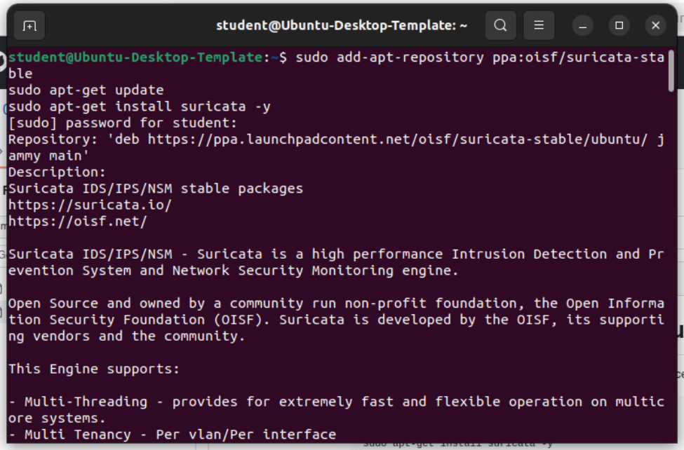
*Configuring Suricata stable repository for installation and installing Suricata package*

### 2. Emerging Threats Rules Download
- Downloaded and extracted latest Emerging Threats rules for Suricata
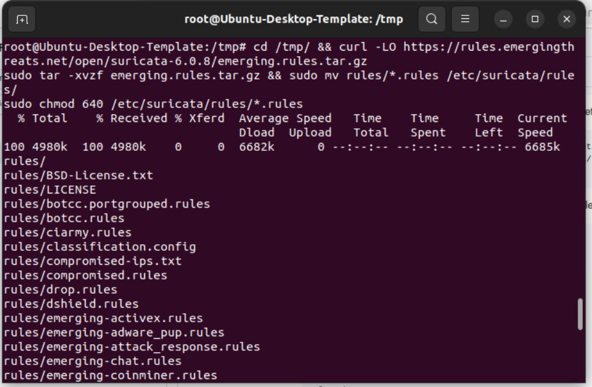
*Downloading comprehensive threat detection rules from Emerging Threats*

### 3. Suricata Configuration Editing
- Modified Suricata configuration file to set network parameters
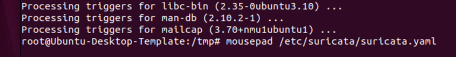
*Editing suricata.yaml to configure HOME_NET and EXTERNAL_NET settings*

### 4. Suricata Configuration Details
- Configured network interfaces and rule paths in suricata.yaml
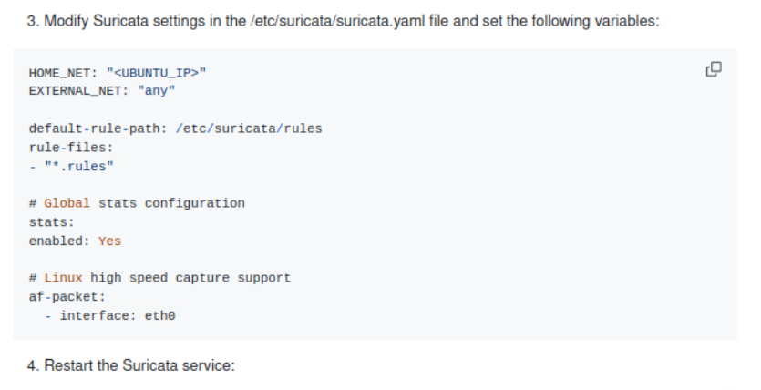
*Setting up network interfaces and rule file paths*

### 5. Suricata Service Restart
- Restart Suricata service
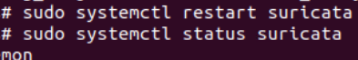
*Restarting Suricata service*

### 6. Initial Suricata Service Failure
- Encountered service startup failure due to permission issues
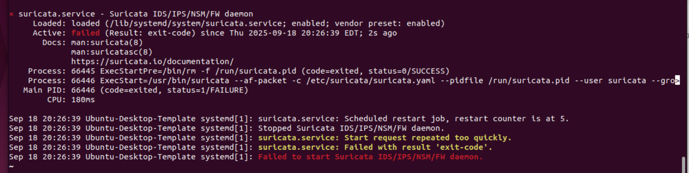
*Initial service failure indicating configuration or permission problems*

### 7. Permission Issues Identified
- Discovered permission errors preventing Suricata from loading rules
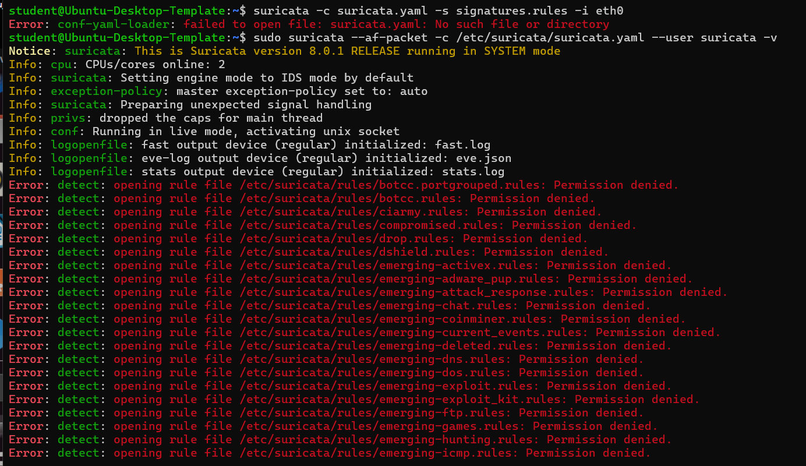
*Suricata log showing permission denied errors for rule files*

### 8. Permission Fix Implementation
- Corrected file ownership and permissions for Suricata rules directory
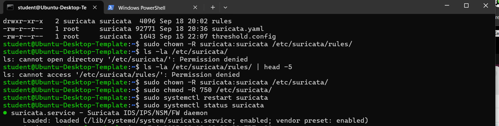
*Fixing ownership and permissions for Suricata configuration files*

### 9. Successful Suricata Service Restart
- Verified successful Suricata service startup after permission fixes
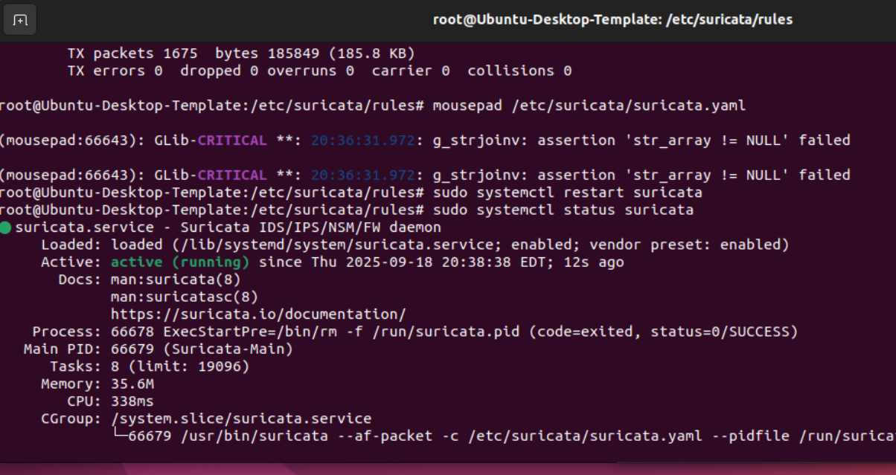
*Suricata service running successfully after permission corrections*

### 10. Wazuh Agent Configuration for Suricata
- Added Suricata log monitoring to Wazuh agent configuration
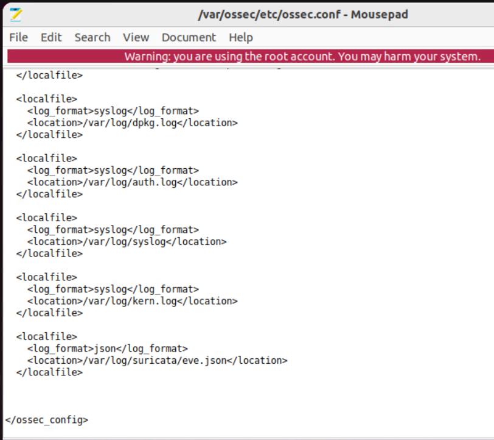
*Configuring Wazuh agent to monitor Suricata eve.json logs*

### 11. Authentication Events Monitoring
- Detailed view of SSH authentication failures and successes
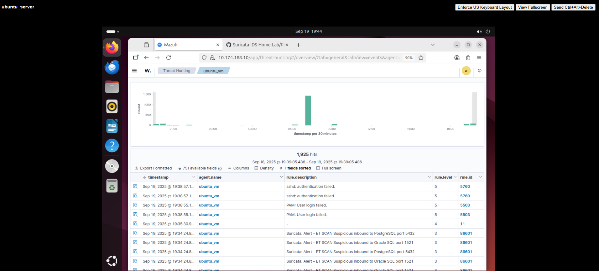
*Monitoring SSH authentication attempts and failures*

### 12. Suricata Threat Detection in Wazuh (Nmap Scan from External Kali Machine)
- Real-time Suricata alerts for suspicious network activities
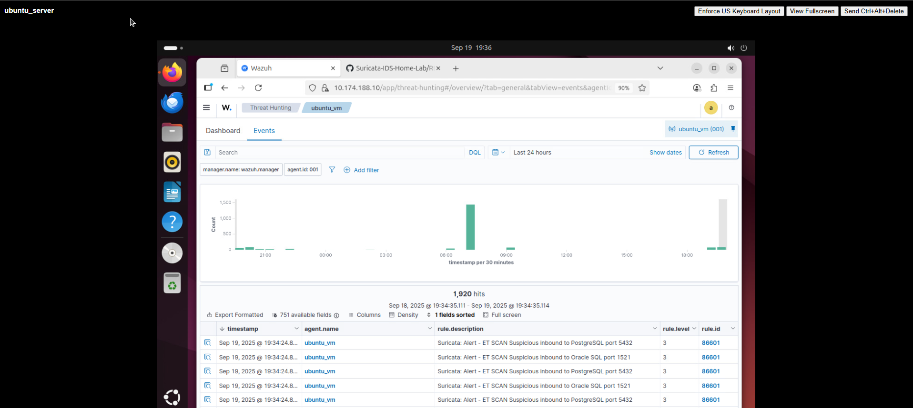
*Suricata detecting port scans and suspicious inbound connections*

### 13. Wazuh Dashboard Alert Overview
- View of total alerts and top alert groups in Wazuh dashboard
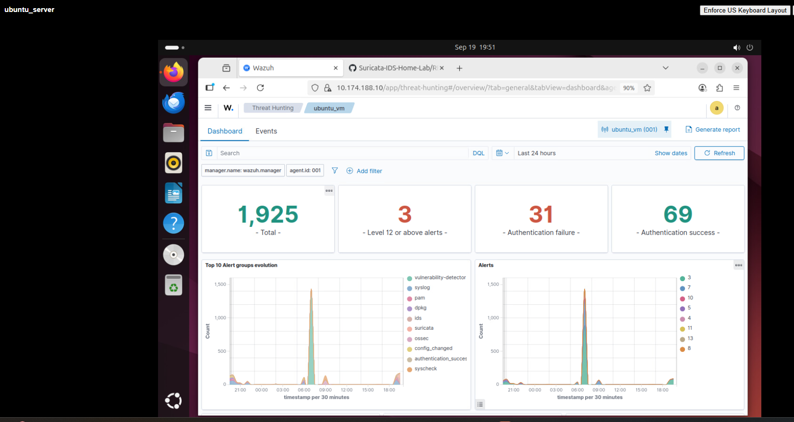
*Dashboard showing 1,925 total alerts with threat categorization*

---

## Observations and Challenges

### Technical Challenges
- **Permission Issues**: Suricata service failed to start due to incorrect file ownership and permissions on rules directory
- **Rule Loading Errors**: Multiple "Permission denied" errors when Suricata attempted to load threat detection rules
- **Service Configuration**: Required precise configuration of network interfaces and rule paths in suricata.yaml
- **Integration Complexity**: Ensuring proper Wazuh agent configuration to collect Suricata JSON events

### Implementation Issues
- **File Ownership**: Needed to change ownership of /etc/suricata/ directory to suricata user
- **Permission Levels**: Required setting appropriate read permissions (750) for Suricata to access rules
- **Network Interface**: Configuration required correct interface name (ens160 instead of eth0)
- **Rule Management**: Ensuring all Emerging Threats rules were properly installed and accessible

### Operational Challenges
- **Performance Impact**: Monitoring system resource usage during high network traffic

---

## Reflections

### Security Insights
- **Threat Detection**: Improved ability to detect network reconnaissance and attack patterns
- **Layered Security**: Understanding how network and host-based security tools complement each other
- **Real-time Monitoring**: Real-time network traffic analysis and alerting
- **Incident Correlation**: Correlating network events with system-level security incidents

### Problem-Solving Skills
- **Troubleshooting**: Enhanced ability to diagnose and resolve service startup issues
- **Configuration Management**: Improved skills in editing complex YAML configuration files
- **Integration Testing**: Experience verifying end-to-end detection capabilities from network to SIEM

---

## How to Reproduce

### Prerequisites
- Ubuntu VM with Wazuh agent installed (from previous project)
- Network connectivity between monitoring interfaces
- Administrative privileges on Ubuntu system
- Kali Linux machine for testing detection capabilities

### Step-by-Step Implementation

1. **Install Suricata IDS/IPS**
```bash
# Add Suricata stable repository and update package list
sudo add-apt-repository ppa:oisf/suricata-stable
sudo apt-get update
sudo apt-get install suricata -y
```

2. **Download and Install Emerging Threats Rules**
```bash
# Download latest Emerging Threats ruleset
cd /tmp
curl -LO https://rules.emergingthreats.net/open/suricata-6.0.8/emerging.rules.tar.gz

# Extract and install rules
sudo tar -xvzf emerging.rules.tar.gz
sudo mv rules/*.rules /etc/suricata/rules/
sudo chmod 640 /etc/suricata/rules/*.rules
```

3. **Configure Suricata Settings**
```bash
# Edit Suricata configuration file
sudo mousepad /etc/suricata/suricata.yaml

# Set the following variables:
# HOME_NET: "10.174.188.11"  # Replace with your Ubuntu Agent VM IP
# EXTERNAL_NET: "any"
# default-rule-path: /etc/suricata/rules
# rule-files: ["*.rules"]
# interface: ens160  # Verify correct interface name
```

4. **Fix File Permissions**
```bash
# Correct ownership and permissions
sudo chown -R suricata:suricata /etc/suricata/
sudo chmod -R 750 /etc/suricata/
```

5. **Configure Wazuh Integration**
```bash
# Edit Wazuh agent configuration
sudo mousepad /var/ossec/etc/ossec.conf

# Add Suricata JSON log monitoring:
# <localfile>
#   <log_format>json</log_format>
#   <location>/var/log/suricata/eve.json</location>
# </localfile>
```

6. **Start and Verify Services**
```bash
# Restart Suricata service
sudo systemctl restart suricata
sudo systemctl status suricata

# Restart Wazuh agent
sudo systemctl restart wazuh-agent

# Monitor Suricata logs for events
tail -f /var/log/suricata/suricata.log
tail -f /var/log/suricata/eve.json
```

7. **Test Detection Capabilities**
```bash
# From Kali Linux machine, perform network scans:

# Pinging
ping 10.174.188.11

# Port scan on Ubuntu VM
nmap -sS 10.174.188.11

# SSH connection attempts
ssh student@10.174.188.11
```

8. **Verify Wazuh Dashboard**
```bash
# Access Wazuh dashboard at https://10.174.188.10
# Check for Suricata alerts in Security Events
# Verify agent shows as "Active" with Suricata integration
# Monitor real-time detection of network scans and attacks
```